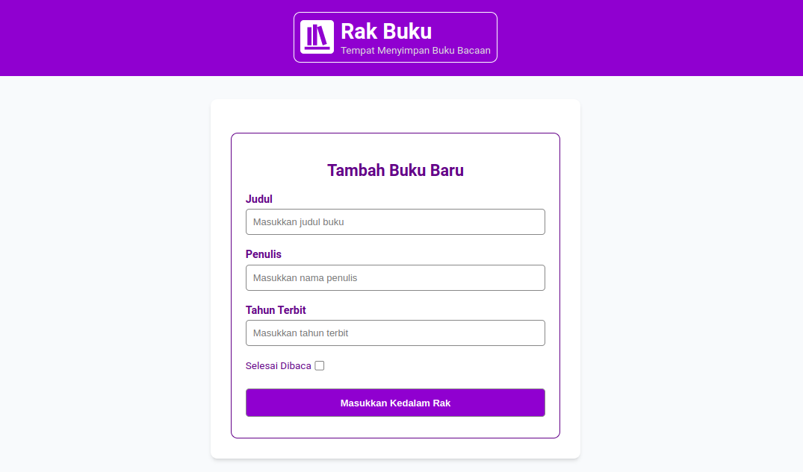

<h1 align="center">Rak Buku</h1>
<div>
    
</div>

<br>

<div align="center">
    <p>Rak Buku is a web application to store reading books, we can add a new book and move books between shelves by marking them as "selesai dibaca (read)" or "belum selesai (unfinished)". We can also remove the book from the bookshelf by pressing the "hapus buku (delete book)" button and edit the book by pressing the edit icon.</p>
    <br>
    <a href="https://ekialfani.github.io/rak-buku/">View Demo</a>
    &nbsp;·&nbsp;
    <a href="https://github.com/ekialfani/rak-buku/issues">Report Bug</a>
</div>

<br><br>

## Built With
- HTML
- CSS
- JavaScript

## installation
* Clone the repo
  ```sh
  git clone https://github.com/ekialfani/rak-buku
  ```

##  Contributing
1. Fork the project
2. Create your feature branch (`git checkout -b my-new-feature`)
3. Commit to the branch (`git commit -am 'Add some feature'`)
4. Push to the branch (`git push origin my-new-feature`)
5. Create a new pull request